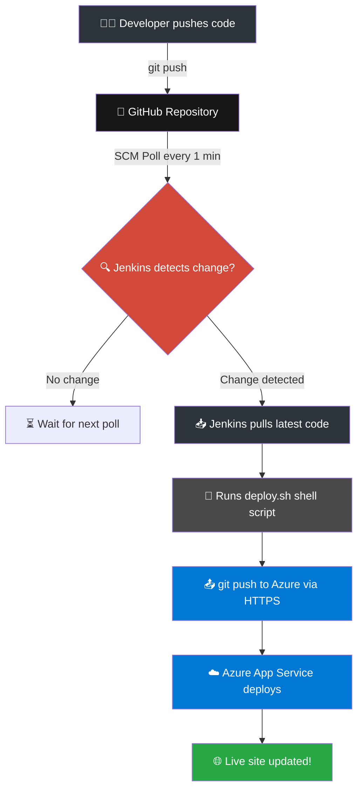

# Jenkins-CI-CD-Static-Website-Host
<div align="center">
<!-- BADGES -->
<p>
  
  
  
  
  
</p>

<p>
  
  
  
  
</p>

<br/>

> **🚀 A production-style DevOps mini-project** — automated end-to-end CI/CD pipeline using Jenkins on RHEL 9, GitHub source control, and Microsoft Azure App Service as the live deployment target. Every `git push` triggers a fully automated build-and-deploy cycle with zero manual steps.

</div>

---

## 📋 Table of Contents

- [🔭 Project Overview](#-project-overview)
- [🏗️ Architecture](#️-architecture)
- [⚙️ Pipeline Flow](#️-pipeline-flow)
- [🛠️ Tech Stack](#️-tech-stack)
- [📁 Repository Structure](#-repository-structure)
- [🚀 Setup & Configuration](#-setup--configuration)
- [🔧 Jenkins Configuration](#-jenkins-configuration)
- [☁️ Azure Deployment](#️-azure-deployment)
- [🔐 Security Best Practices](#-security-best-practices)
- [🤝 Contributing](#-contributing)

---

## 🔭 Project Overview

This project demonstrates a **real-world CI/CD pipeline** that automates code integration and deployment from a developer's local machine all the way to a live Azure-hosted website — with zero manual intervention after initial setup.

| Feature | Detail |
|---|---|
| 🔁 **Trigger** | Jenkins polls GitHub every **1 minute** |
| 🖥️ **CI Server** | Jenkins running on a **RHEL 9 VM** |
| 📦 **Source Code** | Hosted on **GitHub** (`index.php` + shell script) |
| ☁️ **Deploy Target** | **Microsoft Azure App Service** |
| 🔗 **Deploy Method** | `git push` via **HTTPS from Jenkins** |
| ⏱️ **Deploy Time** | ~60 seconds after a `git commit` |

---

## 🏗️ Architecture

```
  👨‍💻 Developer (You)
       │
       │  git commit + push
       ▼
  ┌─────────────────────┐
  │    GitHub Repo       │   ← Stores source code (index.html)
  └────────┬────────────┘
           │
           │  Jenkins polls every 1 min (SCM Polling)
           ▼
  ┌─────────────────────────────────────────┐
  │         Jenkins on RHEL 9 VM            │
  │                                         │
  │  ✅ Pulls latest code from GitHub       │
  │  ✅ Runs deploy shell script            │
  │  ✅ Pushes to Azure App Service (HTTPS) │
  └──────────────────┬──────────────────────┘
                     │
                     │  git push via HTTPS
                     ▼
  ┌─────────────────────────────────────────┐
  │      Microsoft Azure App Service        │
  │                                         │
  │  🌐 your-app.azurewebsites.net          │
  │  🟢 Live website on the internet        │
  └─────────────────────────────────────────┘
```

---

## ⚙️ Pipeline Flow



### 📌 Step-by-Step Breakdown

| Step | Actor | Action |
|------|--------|--------|
| 1️⃣ | **You** | `git add . && git commit -m "msg" && git push` |
| 2️⃣ | **GitHub** | Stores and versions the latest code |
| 3️⃣ | **Jenkins** | Polls GitHub every 60 seconds via SCM trigger |
| 4️⃣ | **Jenkins** | Detects new commit → pulls the latest code |
| 5️⃣ | **Jenkins** | Executes `deploy.sh` — shell script with deploy logic |
| 6️⃣ | **Jenkins** | Pushes built code to Azure App Service via HTTPS |
| 7️⃣ | **Azure** | App Service receives the push and serves the updated site |

---

## 🛠️ Tech Stack

<div align="center">

| Tool | Role |
|------|------|
|  | CI/CD Automation Engine |
|  | Source Code Management |
|  | Jenkins Host OS (Virtual Machine) |
|  | Cloud Deployment Target |
|  | Deployment Automation Script |
|  | Version Control + Deploy Push |

</div>

---

## 📁 Repository Structure

```
📦 DevOps-mini-project-using-Jenkins-CI-CD/
├── 📄 index.php        # Main web application file
└── 📖 README.md           # You are here!
```

---

## 🚀 Setup & Configuration

### ✅ Prerequisites

Before getting started, make sure you have:

- A **RHEL 9** (or compatible Linux) VM with `sudo` access
- **Jenkins** installed and accessible on port `8080`
- A **GitHub** account and a repository with your source code
- A **Microsoft Azure** account with an App Service created
- **Git** installed on the Jenkins VM

---

### 1️⃣ Clone This Repository

```bash
git clone https://github.com/hsjadeja-7117/DevOps-mini-project-using-Jenkins-CI-CD.git
cd DevOps-mini-project-using-Jenkins-CI-CD
```

---

### 2️⃣ Install Jenkins on RHEL 9

```bash
# Add Jenkins repo and import key
sudo wget -O /etc/yum.repos.d/jenkins.repo \
    https://pkg.jenkins.io/redhat-stable/jenkins.repo
sudo rpm --import https://pkg.jenkins.io/redhat-stable/jenkins.io-2023.key

# Install Java (Jenkins dependency)
sudo dnf install java-17-openjdk -y

# Install Jenkins
sudo dnf install jenkins -y

# Start and enable Jenkins service
sudo systemctl enable --now jenkins

# Open firewall port 8080
sudo firewall-cmd --permanent --add-port=8080/tcp
sudo firewall-cmd --reload
```

> Access Jenkins UI at: **`http://<your-vm-ip>:8080`**

---

### 3️⃣ Configure Git on the Jenkins VM

```bash
# Set git identity (used when Jenkins makes commits/pushes)
git config --global user.email "your-email@example.com"
git config --global user.name "Your Name"

# Store Azure HTTPS credentials securely
git config --global credential.helper store
```

---

## 🔧 Jenkins Configuration

### Create a Freestyle Job

1. Go to **Jenkins Dashboard** → **New Item**
2. Select **Freestyle Project** → Name it → Click **OK**

---

### Source Code Management

```
✅ Git
   Repository URL : https://github.com/<your-username>/<repo>.git
   Credentials    : Add GitHub Username + Personal Access Token (PAT)
   Branch         : */main
```

---

### Build Triggers

```
✅ Poll SCM
   Schedule: * * * * *     ← Polls GitHub every 1 minute
```

> 💡 Use `H/5 * * * *` in production to poll every 5 minutes and reduce server load.

---

### Build Step — Execute Shell

```bash
#!/bin/bash
set -e
echo "==============================="
echo "  Starting Deployment to Azure"
echo "==============================="

# Add Azure remote (ignore error if already exists)
git remote add azure \
  https://<DEPLOY_USER>:<DEPLOY_PASS>@<your-app>.scm.azurewebsites.net/<your-app>.git \
  2>/dev/null || true

# Push latest code to Azure App Service
git push azure main --force

echo "==============================="
echo "  ✅ Deployment Complete!"
echo "==============================="
```

> ⚠️ Replace `<DEPLOY_USER>`, `<DEPLOY_PASS>`, and `<your-app>` with your Azure publish credentials.

---

## ☁️ Azure Deployment

### Create Azure App Service via CLI

```bash
# Login
az login

# Create Resource Group
az group create --name DevOpsRG --location eastus

# Create App Service Plan (Free tier)
az appservice plan create \
  --name DevOpsAppPlan \
  --resource-group DevOpsRG \
  --sku F1

# Create Web App
az webapp create \
  --resource-group DevOpsRG \
  --plan DevOpsAppPlan \
  --name your-unique-app-name \
  --runtime "HTML|5.0"
```

### Retrieve Deployment Credentials

```bash
az webapp deployment list-publishing-credentials \
  --name your-unique-app-name \
  --resource-group DevOpsRG \
  --query "{username:publishingUserName, password:publishingPassword}"
```

> 🔐 Store these credentials in **Jenkins Credential Manager** — never hardcode them in scripts.

---

## 🔐 Security Best Practices

```
🔒  Never commit secrets or passwords to GitHub
🔒  Use Jenkins Credential Manager for all sensitive values
🔒  Use GitHub Personal Access Tokens (PAT) — not account passwords
🔒  Restrict Jenkins port 8080 access to trusted IPs via firewall rules
🔒  Enable Azure App Service deployment slots for safe staging
🔒  Rotate deployment credentials regularly
```

---

## 📸 Screenshots

> _Replace placeholders below with your actual project screenshots._

| Jenkins Dashboard | Build Console Output | Azure Live Site |
|:-:|:-:|:-:|
|  |  |  |

---

## 🤝 Contributing

Contributions, issues and feature requests are welcome!

```bash
# 1. Fork this repository

# 2. Create your feature branch
git checkout -b feature/YourFeature

# 3. Commit your changes
git commit -m "✨ Add YourFeature"

# 4. Push to your branch
git push origin feature/YourFeature

# 5. Open a Pull Request 🎉
```

---

## 📜 License

Distributed under the **MIT License**. See `LICENSE` for details.

---

<div align="center">

**Made with ❤️ by [panchaldhairya16](https://github.com/panchaldhairya16)**

<br/>

⭐ **Star this repo if it helped you learn DevOps!** ⭐


</div>
